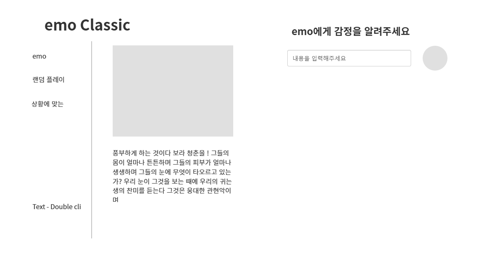
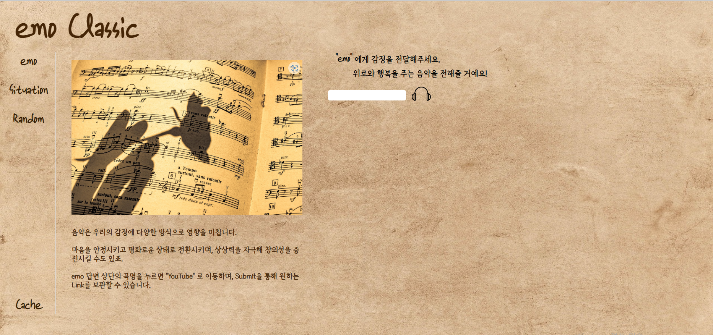
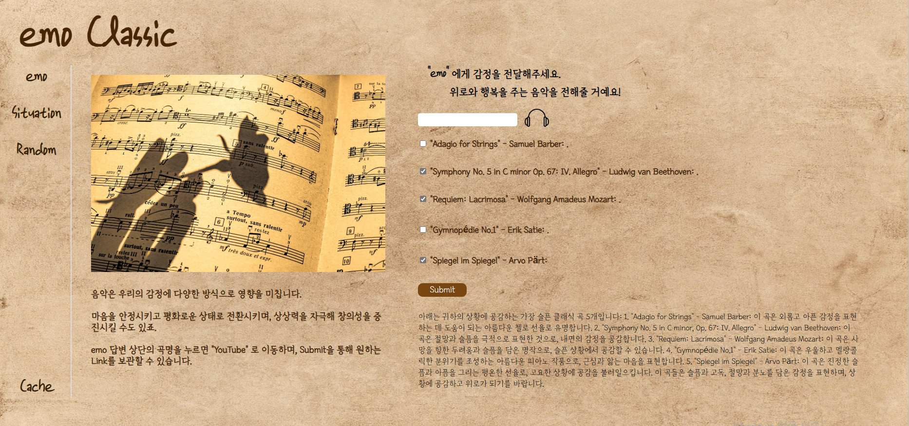
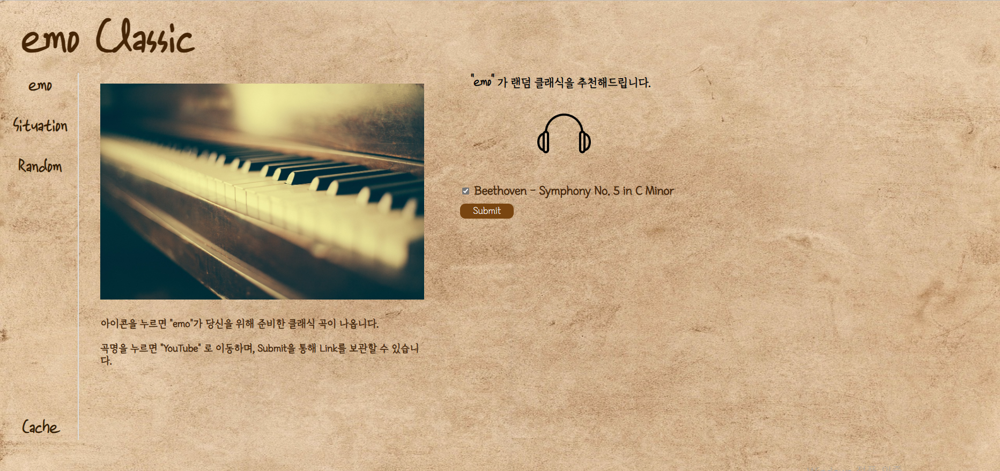
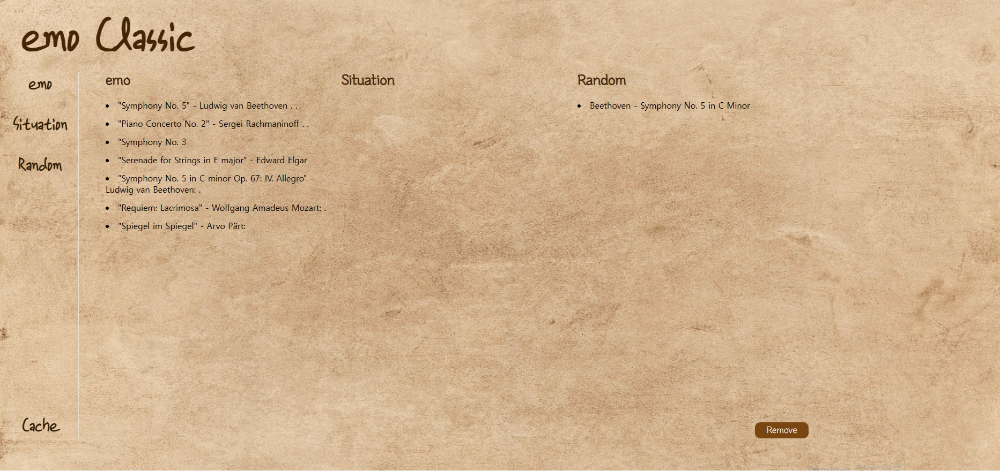

# emo-classic

# 1. 카카오 오븐을 통한 초기 구상
https://ovenapp.io/project/fdVoju98zML3Nsbo6xfCv9H7UZHzyHGf#A3c09



처음 gpt를 활용하여 흔치 않은 사이트를 만들 수는 없을까 고민하다, 사람의 감정과 클래식을 엮어보기로 했습니다.
<br>
<br>
대중음악에 비해 많이 듣지 않는 클래식 음악을 본인의 감정이나 상황, 장소 등의 간단한 단어를 통해 쉽게 접할 수 있도록 하였으며,<br>
지친 사람들을 위로할 수 있으면 좋겠다는 생각으로 구상하였습니다.<br>
<br>

감정에 지친 사람들이 위로를 받는 용도이기에 사용이 용이할 수록 목적에 더 나아갈 수 있다 생각했으며,<br>
<br>
클래식 특성 상 곡의 제목이 복잡하거나 낯설어 기억이 쉽지 않았기에 원하는 음악을 따로 기억해줄 수 있는 장치가 있으면 좋겠다는 생각을 하여, 구상 단계에서부터 Cache를 넣을 생각을 했습니다.
<br>
<br>
사이트의 이름은 Emotion에서 따와 emo-classic으로 지었으나, 전달력이 좋고 발음하기 쉬운 "에모" 클래식으로 정했으며 약칭은 'emo'(에모) 입니다.
<br>
<br>

완성본의 화면과 매우 흡사하며, 초기 구상을 토대로 제작하였습니다.
<br>
<br>
# 2. 설계
카카오 오븐을 토대로 제작에 들어갔으며, CSS, HTML, JavaScript 를 사용하여 제작했습니다.
<br>
<br>
구성은 좌측에 emo(감정), Situation(상황, 장소), Random(무작위) 의 세 가지 컨텐츠와 하단에 캐시 메모리를 두었습니다.
<br>
화면의 백그라운드에는 종이 재질의 이미지를 삽입하였으며, 종이에 글씨를 적은 것 같은 느낌을 주기 위해 필기체와 유사한 글씨를 선택하였습니다.
<br>
<br>
또한, 이질적인 느낌을 줄이기 위해 글자의 색을 브라운 계열 의 부드러운 색으로 변경하였으나, 메인 컨텐츠는 눈에 사로잡힐 수 있도록 black으로 두었습니다.
<br>

<br>
(이해를 돕기 위한 완성본입니다.)
<br>
<br>
기존에는 문답 형식의 간단한 텍스쳐 뿐이었으나, gpt의 곡 추천이 다양한 말들과 함께 나와 추천받은 곡이 한 눈에 보이지 않았고,<br>
<br>
추천받은 곡을 듣기 위해서는 동영상 사이트에 들어가 스스로 검색을 해야하는 번거로움이 있었기에 실용성이 부족하다고 판단하여, gpt의 답변에서 곡 제목을 추출해내 링크 리스트를 만드는 것이 좋을 것 같다 생각하여 이행했습니다.
<br>
<br>

# 3. 다양한 문제들
## 첫 번째 난관.

```js
$link1.innerHTML = `<input type="checkbox" value='${linkList[0]}'/><a href="https://www.youtube.com/results?search_query= ${linkList[0]}" target="_blank">${linkList[0]}</a>`
$link2.innerHTML = `<input type="checkbox" value='${linkList[1]}'/><a href="https://www.youtube.com/results?search_query= ${linkList[1]}" target="_blank">${linkList[1]}</a>`
$link3.innerHTML = `<input type="checkbox" value='${linkList[2]}'/><a href="https://www.youtube.com/results?search_query= ${linkList[2]}" target="_blank">${linkList[2]}</a>`
$link4.innerHTML = `<input type="checkbox" value='${linkList[3]}'/><a href="https://www.youtube.com/results?search_query= ${linkList[3]}" target="_blank">${linkList[3]}</a>`
$link5.innerHTML = `<input type="checkbox" value='${linkList[4]}'/><a href="https://www.youtube.com/results?search_query= ${linkList[4]}" target="_blank">${linkList[4]}</a>`
```
<br>
gpt의 답변을 의도적으로 1.~5.의 배열 형식으로 얻을 수 있게 한 다음 split() 함수를 이용, 정규표현식을 사용해 링크를 추출해 냈습니다.
<br>
<br>
미리 html 내부에 만들어 둔 div 에 나중에 cache 데이터를 보관하는데 필요한 checkbox를 사용하면서 곡명에 유튜브의 검색 링크를 붙여,
<br>
gpt의 답변을 받아 넣는 마지막 .then() 함수 내부에 함께 넣어 질문을 받으면 같이 동작하도록 코딩하였습니다.
<br>
<br>
그러나, 링크가 되다가 안 됐다가 하는 오류가 발생하였고, 아예 안 되는 것은 아니었기에 어디에서 오류가 나는 건지 찾기가 힘들었습니다.
<br>
수많은 검색 후에 encodeURIComponent() 함수를 알게 되었고, 주소창이 받아드리는 문자가 따로 있어 인코딩을 해야 한다는 것을 알고 해결했습니다.
<br>
<br>

```js
$link1.innerHTML = `<input type="checkbox" value='${linkList[0]}'/><a href="https://www.youtube.com/results?search_query= ${encodeURIComponent(linkList[0])}" target="_blank">${linkList[0]}</a>`
$link2.innerHTML = `<input type="checkbox" value='${linkList[1]}'/><a href="https://www.youtube.com/results?search_query= ${encodeURIComponent(linkList[1])}" target="_blank">${linkList[1]}</a>`
$link3.innerHTML = `<input type="checkbox" value='${linkList[2]}'/><a href="https://www.youtube.com/results?search_query= ${encodeURIComponent(linkList[2])}" target="_blank">${linkList[2]}</a>`
$link4.innerHTML = `<input type="checkbox" value='${linkList[3]}'/><a href="https://www.youtube.com/results?search_query= ${encodeURIComponent(linkList[3])}" target="_blank">${linkList[3]}</a>`
$link5.innerHTML = `<input type="checkbox" value='${linkList[4]}'/><a href="https://www.youtube.com/results?search_query= ${encodeURIComponent(linkList[4])}" target="_blank">${linkList[4]}</a>`
    })
```

## 두 번째 난관.

두 번째 난관은 바로 호기롭게 도전한 cache 데이터 넣기였습니다.<br>
그냥 입력 받은 값들을 모조리 넣는 것도 아니었으며, 사용자가 선별한 값을 '다른 페이지'에 사용자의 다른 어떠한 동작 없이 list로 출력되게 하는 것이었습니다.
<br>
<br>
사용자가 체크한 박스의 value 값을 받아낼 수 있는 데이터 베이스를 만드는 것이 가장 중요하였으며, 이를 간단하게 해결할 수 있는 것이 바로 localStorage 였습니다.
<br>
<br>
사용자가 submit 버튼을 누른다면 체크박스를 표시했다는 가정을 할 수 있었고, 이를 통해 데이터를 얻는 함수를 버튼에 onclik 함수를 사용하여 작성했습니다.
<br>
<br>

```js
let checkboxes = document.querySelectorAll('input[type="checkbox"]');
let IsCheck = []
checkboxes.forEach(function(item) {
    if (item.checked) {
        IsCheck.push(item.value)
    }
})
```
<br>
<br>

만약 사용자가 계속 해서 데이터를 누적할 경우 localStorage에는 한 개의 key 당 한 개의 value만 저장될 수 있었기에 계속 덮여쓰이는 현상이 발생하여,<br>
이를 방지하기 위해 버튼을 누를 때 마다 key 값에 1을 추가하여 여러번의 수행에도 데이터를 지켜낼 수 있었습니다.
<br>
<br>

```js

var i = 0;

function getSelectedMusic() {

    let checkboxes = document.querySelectorAll('input[type="checkbox"]');
    let IsCheck = []
    checkboxes.forEach(function(item) {
        if (item.checked) {
            IsCheck.push(item.value)
        }
    })

    localStorage.setItem(i, IsCheck);
    i++

    // 체크박스 초기화.
    checkboxes.forEach((checkbox) => {
        checkbox.checked = false
    });
}
```
<br>
<br>

그러나 이번에는 또 다른 문제가 발생하게 되는데...<br>
<br>
바로 페이지 이동 시 localStorage에 적재된 데이터는 사라지지 않으나, var i = 0;이 초기화 되어 다른 페이지에 갔다가 다시 돌아왔을 때 localStorage의 key 값이 0부터 시작하여 데이터가 덮어 쓰여진다는 것이었습니다.
<br>
<br>

하여, 페이지를 이동해도 사라지지 않는 localStorage에 key값을 적재하여 꺼내 쓰는 방법을 생각하게 됩니다.

<br>
<br>

```js
var i = 0;

function getSelectedMusic() {

    // localStorage에 데이터 저장
    if (localStorage.getItem('i')){
        i = parseInt(localStorage.getItem('i'))
    }

    let checkboxes = document.querySelectorAll('input[type="checkbox"]');
    let IsCheck = []
    checkboxes.forEach(function(item) {
        if (item.checked) {
            IsCheck.push(item.value)
        }
    })

    localStorage.setItem(i, IsCheck);
    i++
    localStorage.setItem('i', i);

    // 체크박스 초기화.
    checkboxes.forEach((checkbox) => {
        checkbox.checked = false
    });
}
```
<br>
<br>

localStorage에 key 값을 사용한 흔적을 먼저 찾고, 없으면 0부터 시작, 만약 흔적이 존재한다면 값을 다시 가져와 사용하는 함수입니다.
<br>
<br>
localStorage에는 value 값이 문자열로 저장되는 것에 유의하여 다음에 사용할 key 값을 value로 집어넣고, 다시 꺼내올 때는 parseInt() 를 사용해 숫자로 변환한 뒤 함수를 진행했습니다.
<br>
<br>

## 세 번째 난관.
이후에는 난관이 아니라 욕심이었습니다.
<br>
<br>
localStorage에 저장된 값들을 cache 페이지에 뿌리기만 하면 됐고,<br>
addEventListener() 버튼 하나면 충분히 쉽게 해결될 수 있는 문제였습니다.
<br>
<br>
그러나 저는 cache 창을 열면 아무런 추가적인 행동 없이 쌓인 데이터가 알아서 펼쳐져있길 바랬고, DOMContentLoaded를 찾았습니다.
<br>
<br>
DOMContentLoaded. 브라우저가 html을 전부 읽고 dom tree를 완성하면 바로 실행됩니다.

```js

document.addEventListener('DOMContentLoaded', () => {

    // localStorage 에 적재 된 emocache 가져오기
    for(var i=0; i<20; i++){
        if(localStorage.getItem(i)){
            let emocache = localStorage.getItem(i).split(',')
    
            for(var j=0; j<emocache.length; j++){
                if(emocache[j].length > 1){
                    $emocache.innerHTML += `<li><a href="https://www.youtube.com/results?search_query= ${encodeURIComponent(emocache[j])}" target="_blank">${emocache[j]}</a></li>`
                }
            }
        }
        
    }

    // localStorage 에 적재 된 Situationcache 가져오기
    for(var i=20; i<40; i++){
        if(localStorage.getItem(i)){
            let Situationcache = localStorage.getItem(i).split(',')
    
            for(var j=0; j<Situationcache.length; j++){
                if(Situationcache[j].length > 1){
                    $Situationcache.innerHTML += `<li><a href="https://www.youtube.com/results?search_query= ${encodeURIComponent(Situationcache[j])}" target="_blank">${Situationcache[j]}</a></li>`
                }
            }
        }
        
    }

    // localStorage 에 적재 된 Randomcache 가져오기
    for(var i=40; i<60; i++){
        if(localStorage.getItem(i)){
            let Randomcache = localStorage.getItem(i).split(',')
    
            for(var j=0; j<Randomcache.length; j++){
                if(Randomcache[j].length > 1){
                    $Randomcache.innerHTML += `<li><a href="https://www.youtube.com/results?search_query= ${encodeURIComponent(Randomcache[j])}" target="_blank">${Randomcache[j]}</a></li>`
                }
            }
        }
        
    }
})

```
<br>
<br>
cache 페이지 하단의 remove 버튼은 localStorage의 모든 내용을 삭제하여 cache 페이지를 비우고, localStorage에 데이터 적재를 위한 key 값을 다시 초기화합니다.

```js
// 캐시 삭제
function clearcache(){
    localStorage.clear()
}
```
<br>
<br>

# 4. 아쉬운 점
무엇보다 가장 아쉬운 점은 gpt를 다루는 것이 너무 어렵다는 것입니다.
<br>
<br>
완성을 한 지금도 가끔 오류가 나기도 하고, 어떨때는 대답을 회피하는 모습까지 보여 "프롬프트 엔지니어" 라는 직업이 괜히 생긴게 아니구나 하는 실감을 절실히 했습니다.
<br>
<br>
또한, 정규표현식을 이번에 처음으로 사용하면서 복잡하기도 하고 아직도 잘 이해하지 못 해 링크 정제가 깔끔하게 되지 않는다는 점입니다.
<br>
gpt가 돌발 행동을 자주 할 수록 정규표현식을 더 깊게 공부해야 할 필요성을 더더욱 느끼게 되었습니다.
<br>
<br>

# 5. 결과





<br>
<br>
배포 URL : https://gangto33.github.io/emo-classic.github.io/
<br>
<br>
어설픈 부분도, 미흡한 점도 많지만 html css js를 처음 접했음에도 불구하고 제가 구상한 대로 잘 만들어진 것 같아 뿌듯합니다.
<br>
